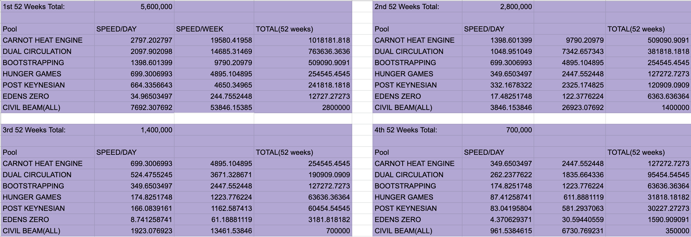

# 💲 Stable Coin Lending Protocol (PAWN)


PAWN is a forked protocol of Abracadabra.


PAWN is a lending protocol that uses many sBCH assets (current WBCH and LAW) as collateral to borrow a USD pegged stablecoin (lawUSD), that can be used as any other traditional stablecoin.

### lawUSD Value Stabilizer

.png>)

The price stability of lawUSD is achieved by the protocol’s lawUSD Value Stabilizer, which incentivizes the minting or burning of lawETP through arbitrage opportunities. Arbitrage occurs when a user profits from price differences between markets.

PAWN enables users to always exchange $1 worth of lawETP for lawUSD and vice versa, incentivizing users to maintain the price of lawUSD.

### Borrow/Repay

#### Depositing Collateral and Borrowing lawUSD

Head over to [https://blockng.money](https://blockng.money) and click on **PAWN**.

The borrow section of the website displays a variety of assets that can be used as collateral, you can choose one of them.

On the right side are the parameters of the market :&#x20;

* Maximum collateral ratio (MCR) - MCR represents the maximum amount of debt a user can borrow with a selected collateral token.
* Liquidation Fee - This is the discount a liquidator gets when buying collateral flagged for liquidation.
* Borrow Fee - This fee is added to your debt every time you borrow lawUSD
* Interest - This is the annualized percent that your debt will increase each year.

Once your component has been selected, the **BORROW/REPAY** section will appear.

.png>)

First, decide how much LAW will be used as collateral. After depositing  ,then decide how much lawUSD will be borrowed by either typing in the numbers or using the SAFEMAX button.

When 'BORROW' is executed, the lawUSD will be in the wallet balance.

In the same way, you need to use the 'REPAY' button to repay the loan and then use the 'REMOVE COLLATERAL' function to retrieve your LAW.

### MY OPEN POSITION

On the right, you will see a frame called **MY OPEN POSITION** that contains dynamic information pertinent to this specific position. If you open a position using a different component these numbers will adjust to that isolated market. If you adjust your position, these numbers will adjust accordingly. Please note that every time you edit your position (add more collateral or borrow more lawUSD) these numbers will adjust accordingly. **The liquidation price stated here is the one that will decide when your total position gets liquidated or not.**

****

* **Collateral deposited** - This is the amount of component tokens you have supplied to this position.
* **Collateral value** - This is the total value in USD of all the components you have supplied to this position
* **MIM borrowed** - This is the total value and quantity of **lawUSD** you have borrowed. The protocol always considers 1 lawUSD to equal 1 USD
* **Liquidation price** - This is the price of the component at which your position will be flagged for liquidation.&#x20;
* **lawUSD left to borrow** - This is how many lawUSD you may still borrow before have reached your maximum allowance. To adjust this allowance you may either repay or add collateral.

### **The Liquidation Price**

The liquidation price is the price of your collateral at which you will be liquidated. If your collateral value decreases to a point where the liquidation price matches the price of the token that is used as collateral your position will be flagged for liquidation. The contract will not allow liquidators to perform liquidation above the liquidation price, meaning that the user's collateral is safe up until the stated total liquidation price.

